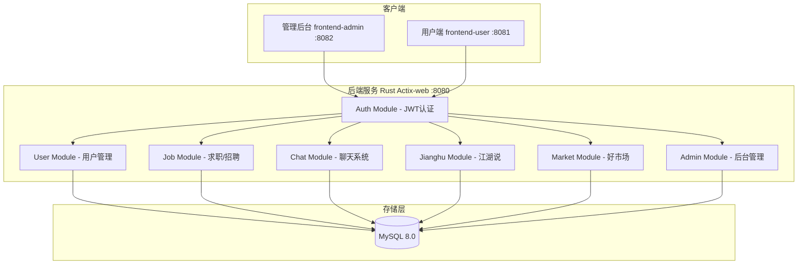
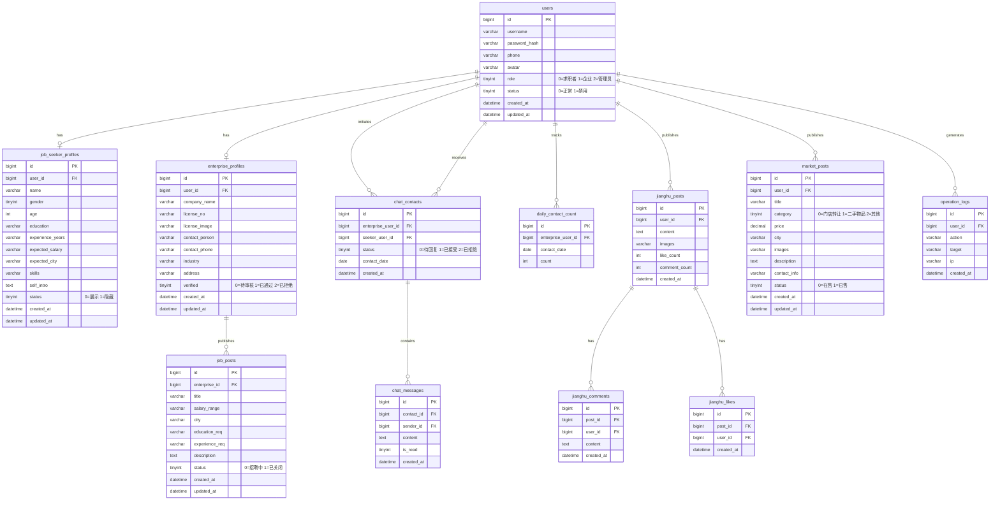

# 人才网平台 - 项目设计文档

## 1. 系统架构

## 2. ER 图

## 3. 接口清单

### Auth Controller
| Method | Path | Description |
|--------|------|-------------|
| POST | /api/auth/register | 用户注册 |
| POST | /api/auth/login | 用户登录 |
| GET | /api/auth/me | 获取当前用户信息 |

### User Controller
| Method | Path | Description |
|--------|------|-------------|
| PUT | /api/user/profile | 更新个人资料 |
| PUT | /api/user/avatar | 上传头像 |
| PUT | /api/user/password | 修改密码 |

### JobSeeker Controller
| Method | Path | Description |
|--------|------|-------------|
| POST | /api/seeker/profile | 创建/更新求职档案 |
| GET | /api/seeker/profile | 获取自己的求职档案 |
| GET | /api/seeker/list | 求职者列表(企业浏览) |
| GET | /api/seeker/{id} | 求职者详情 |

### Enterprise Controller
| Method | Path | Description |
|--------|------|-------------|
| POST | /api/enterprise/profile | 提交企业认证 |
| GET | /api/enterprise/profile | 获取企业档案 |
| POST | /api/enterprise/job | 发布招聘 |
| PUT | /api/enterprise/job/{id} | 编辑招聘 |
| DELETE | /api/enterprise/job/{id} | 删除招聘 |
| GET | /api/enterprise/jobs | 我的招聘列表 |
| GET | /api/jobs | 招聘列表(公开) |
| GET | /api/jobs/{id} | 招聘详情 |

### Chat Controller
| Method | Path | Description |
|--------|------|-------------|
| POST | /api/chat/contact | 企业发起联系 |
| PUT | /api/chat/contact/{id}/reply | 求职者回复(接受/拒绝) |
| GET | /api/chat/contacts | 我的联系列表 |
| POST | /api/chat/message | 发送消息 |
| GET | /api/chat/messages/{contact_id} | 获取聊天记录 |
| PUT | /api/chat/messages/{contact_id}/read | 标记已读 |

### Jianghu Controller
| Method | Path | Description |
|--------|------|-------------|
| POST | /api/jianghu/post | 发布动态 |
| GET | /api/jianghu/posts | 动态列表 |
| POST | /api/jianghu/post/{id}/like | 点赞/取消 |
| POST | /api/jianghu/post/{id}/comment | 评论 |
| GET | /api/jianghu/post/{id}/comments | 评论列表 |
| DELETE | /api/jianghu/post/{id} | 删除动态 |

### Market Controller
| Method | Path | Description |
|--------|------|-------------|
| POST | /api/market/post | 发布商品 |
| GET | /api/market/posts | 商品列表 |
| GET | /api/market/post/{id} | 商品详情 |
| PUT | /api/market/post/{id} | 编辑商品 |
| DELETE | /api/market/post/{id} | 删除商品 |

### Admin Controller
| Method | Path | Description |
|--------|------|-------------|
| GET | /api/admin/users | 用户列表 |
| PUT | /api/admin/user/{id}/status | 禁用/启用用户 |
| GET | /api/admin/enterprises | 企业认证审核列表 |
| PUT | /api/admin/enterprise/{id}/verify | 审核企业 |
| GET | /api/admin/logs | 操作日志 |
| GET | /api/admin/stats | 统计数据 |

## 4. UI/UX 规范

| 属性 | 值 |
|------|-----|
| 主色调 | #2563EB (蓝色) |
| 辅助色 | #10B981 (绿色) |
| 警告色 | #F59E0B (橙色) |
| 危险色 | #EF4444 (红色) |
| 背景色 | #F3F4F6 |
| 卡片背景 | #FFFFFF |
| 文字主色 | #1F2937 |
| 文字次色 | #6B7280 |
| 字体 | -apple-system, "PingFang SC", "Microsoft YaHei" |
| 卡片圆角 | 12px |
| 按钮圆角 | 8px |
| 阴影 | 0 2px 12px rgba(0,0,0,0.08) |
| 间距基数 | 8px (8/16/24/32) |
